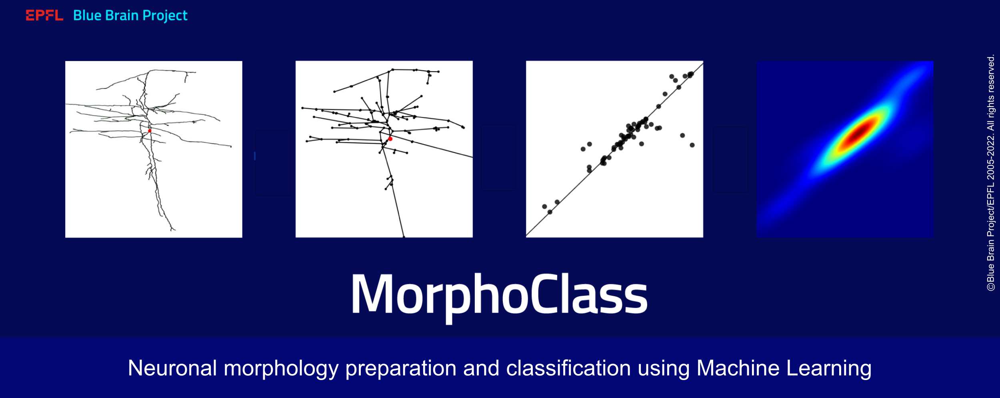

# Morphology-Classification
MorphoClass is a toolbox for neuronal morphologies processing and
classification using machine learning.

<table>
    <tr>
        <td>Documentation</td>
        <td>
            <a href="https://morphoclass.readthedocs.io/en/latest/">
                
            </a>
        </td>
    </tr>
    <tr>
        <td>License</td>
        <td>
            <a href="https://github.com/BlueBrain/morphoclass/blob/master/LICENSE.txt">
                
            </a>
        </td>
    </tr>
    <tr>
        <td>Static Typing</td>
        <td>
            <a href="http://mypy-lang.org/">
                
            </a>
        </td>
    </tr>
    <tr>
        <td>Code Style</td>
        <td>
            <a href="https://github.com/psf/black">
                
            </a>
            <a href="https://pycqa.github.io/isort/">
                
            </a>
            <a href="https://flake8.pycqa.org/">
                
            </a>
        </td>
    </tr>
    <tr>
        <td>CI</td>
        <td>
            <a href="https://github.com/BlueBrain/morphoclass/actions/workflows/ci.yaml?query=branch:main">
                
            </a>
        </td>
    </tr>
</table>


# Installation
Clone the repository and set up the virtual environment
```sh
git clone git@github.com:BlueBrain/morphoclass.git
cd morphoclass
python --version  # should be 3.8
python -m venv venv
. venv/bin/activate
```

Install `morphoclass`
```sh
./install.sh
```

Open the file `docs/build/html/index.html` to view the documentation.

# Examples
MorphoClass functionalities can be accessed using either a command line
interface or by importing `morphoclass` as a Python module and using it as a
library.

## Command-Line Interface
By installing MorphoClass, we get access to a command line interface with a
main entrypoint `morphoclass` and various sub-commands.
```sh
morphoclass --help
```
```
Usage: morphoclass [OPTIONS] COMMAND [ARGS]...

  Welcome to the command line application for morphoclass.

  All functionality is provided through respective sub-commands. To learn more
  about their functionality call the corresponding sub-command with the --help
  flag to see a detailed description.

Options:
  ...

Commands:
  ...
```

For instance, to train a model for classifying neuronal morphologies, we can
check the help of the corresponding sub-command.
```sh
morphoclass train --help
```
```
Usage: morphoclass train [OPTIONS]

  Train a morphology classification model.

Options:
  ...
```

## Python Interface
MorphoClass is a pure Python package, and can be used as any other module once
it is installed.

For instance, we can load a PersLay-based model for morphology classification
and check its documentation as follows.
```py
>>> from morphoclass.models.coriander_net import CorianderNet
>>> help(CorianderNet)
```
```
Help on class CorianderNet in module morphoclass.models.coriander_net:

class CorianderNet(torch.nn.modules.module.Module)
 |  CorianderNet(n_classes=4, n_features=64, dropout=False)
 |
 |  A PersLay-based neural network for neuron m-type classification.
 |
 |  Parameters
 |  ----------
 ...
```

# Documentation
For more examples and details on the installation, development setup, docker,
the command line interface, and the python API please see the extended
documentation on https://morphoclass.readthedocs.io

# Funding & Acknowledgment
The development of this software was supported by funding to the Blue Brain
Project, a research center of the École polytechnique fédérale de Lausanne
(EPFL), from the Swiss government's ETH Board of the Swiss Federal Institutes
of Technology.

Copyright © 2022-2022 Blue Brain Project/EPFL
