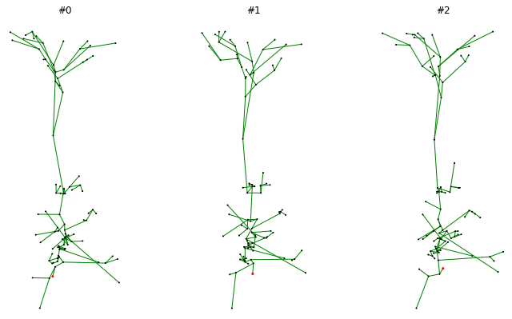

.. _data:

Data
====

- Datasets (graph and persistence)
- Data Loaders
- Transforms

Loading Datasets
----------------
Datasets of morphological data are represented by the ``morphoclass.data.MorphologyDataset``
class. The dataset can be initialised by loading the morphology data from disk in
three different ways:

- From a list of paths
- From a CSV file with paths
- From a structured dataset directory

The actual loading of the files is delegated to the ``load_neuron`` function from
the ``neurom`` package, and the supported morphology file types are ``h5``, ``swc``, and ``asc``.

From a list of paths
....................
The following code shows how to load data from a list of paths to the morphology files::

    import pathlib

    from morphoclass.data import MorphologyDataset

    data_path = pathlib.Path.cwd() / "data"

    paths = [
        data_path / "dataset" / "L5" / "TPC_A" / "C050896A-P3.h5",
        data_path / "dataset" / "L5" / "TPC_B" / "C030397A-P2.h5",
        data_path / "dataset" / "L5" / "TPC_C" / "C231296A-P4A2.h5",
        data_path / "dataset" / "L5" / "UPC" / "rp101228_L5-2_idD.h5",
    ]
    labels = ["TPC_A", "TPC_B", "TPC_C", "UPC"]

    dataset = MorphologyDataset.from_paths(paths, labels)

The ``labels`` argument is optional and can be omitted.

From a CSV file
...............
To streamline the data loading all paths can be saved in a CSV file, which can then be used
to initialise the dataset class:

.. code-block:: text
    :caption: dataset.csv

    dataset/L5/TPC_A/C050896A-P3.h5,TPC_A
    dataset/L5/TPC_B/C030397A-P2.h5,TPC_B
    dataset/L5/TPC_C/C231296A-P4A2.h5,TPC_C
    dataset/L5/UPC/rp101228_L5-2_idD.h5,UPC

The paths in the CSV file can bei either absolute or relative. Relative paths have
to be relative to the directory containing the CSV file.

The CSV file should container no headers, contain paths to morphology files in the first
column, and optionally labels for the morphologies in the second column.

The following code loads the morphologies listed in the CSV file above::

    dataset = MorphologyDataset.from_csv(data_path / "dataset.csv")

From a structured directory
...........................
Finally, the morphology dataset can be initialised from a directory with the following structure

.. code-block:: text

    dataset/
        label_1/
            file_1
            file_2
            ...
        label_2/
            file_101
            file_102
            ...

The following code loads all morphologies from a structured directory as above::

    dataset = MorphologyDataset.from_structured_dir("data/dataset")

The labels will be automatically inferred from the directory structure.

Data Objects
------------
The data in the morphology dataset can be access by indexing the dataset object like a list::

    sample = dataset[0]

The individual samples in the dataset are represented as instances of the ``Data`` class.
This allows to store an arbitrary number of attributes attached to each sample, which
can for example be useful for data transforms (see below).

By default, each sample in the dataset will contain the fields ``morphology``, and ``path``
which contain the morphology and the path it was loaded from::

    print(sample.morphology)
    print(sample.path)

If sample labels were provided then two additional attributes are attached to the samples:
``y``, and ``label``. The attributes ``label`` are the raw labels that were provided upon
loading the dataset, and ``y`` are auto-generated consecutive integers starting with 0
that represent each of the label classes. These can be used by the morphology classification
models for training and evaluation::

    print(sample.y)
    print(sample.label)

Filters
-------
Sometimes it is useful to load parts of a given dataset or omit certain morphology files
from the dataset. This can be done by setting the ``pre_filter`` parameter in any of
the three factory methods for data loading that were presented above::

    dataset = MorphologyDataset.from_csv(data_path / "dataset.csv", pre_filter=my_filter)

The object ``my_filter`` should be a callable that takes one parameter of type ``Data``
representing one single data sample, as described above, and return a boolean. The following
example shows a filter function that discards all samples located in a folder which name
contains "UPC"::

    def my_filter(sample):
        if "UPC" in pathlib.Path(sample.path).parent.name:
            return False

        return True

The ``morphoclass`` package pre-defines several useful filters that can be found in the
``morphoclass.data.filters`` module. The following filters are currently available:

- ``exclusion_filter(list_of_filenames)`` -- exclude morphology files with the given
  file names (without extension)
- ``exclusion_filter(mtype_substring)`` -- exclude files with parent directories that
  contain the given substring (e.g. a filter with ``mtype_substring = "UPC"`` would
  exclude all files in the "L5/UPC" directory)
- ``inclusion_filter(list_of_filenames)`` -- only include morphology files with the given
  file names (without extension)
- ``has_apicals_filter`` -- only include morphologies that have apical dendrites
- ``combined_filter(filter_1, filter_2, ...)`` -- combine multiple filters into one.

Here's an example of the usage of pre-defined filters::

    from morphoclass.data import filters, MorphologyDataset

    dataset = MorphologyDataset.from_csv(
        csv_file=data_path / "dataset.csv",
        pre_filter=filters.combined_filter(
            filters.has_apicals_filter,
            filters.exclusion_filter("UPC"),
            filters.exclusion_filter(["bad_file_1", "bad_file_2"])
        )
    )

This loads all morphologies specified in the "dataset.csv" file that have apical
dendrites, are not in a directory with the name containing "UPC", and the filenames
of which are not "bad_file_1" or "bad_file_2".

Of course any manually defined filter can be used in ``combined_filter`` along
with the pre-defined ones.

Transforms
----------
Data transforms are a powerful idea that let you modify the morphologies and data
associated with them in an arbitrary manner.

The transforms can be specified at the initialisation time of the morphology dataset by
using one of the two parameters:

- ``pre_transform``
- ``transform``

The difference between the two is the point of time when these transforms take place.

The former, ``pre_transform``, takes place at the same time as data loading, and only the
result of the transform will be saved in the ``MorphologyDataset`` class. This type of
transform is useful for data pre-processing and feature extraction.

The latter, ``transform``, specifies transforms that take place every time a sample
is retrieved from the dataset. Such transforms can be useful for data augmentation
and allow for dynamically and randomly generated transforms.

.. important::
    The transforms operate on the original data in a given sample. If you don't want
    that the changes be permanent, consider using the ``MakeCopy`` transform (see
    examples below)

.. important::
    Keep in mind that because transforms specified through the ``transform`` parameter
    take place every time a sample is retrieved, this can have considerable impact on
    the performance of code that repeatedly retrieves samples from the dataset, such
    as a training loop for a machine learning model. Therefore it is advised to keep
    such transforms light-weight and to use ``pre_transform`` as much as possible.

All transforms are defined in the ``morphoclass.transforms`` module. They can be logically
grouped into the following classes:

- Augmentors
- Feature extractors
- Feature scalers
- Miscellaneous

Pre-Processing and Augmentation
...............................

Here's an example of how transforms can be used to pre-process the data, and to
apply dynamic data augmentation in form of random node jittering::

    from morphoclass import transforms
    from morphoclass.data import MorphologyDataset

    pre_transform = transforms.Compose([
        transforms.ExtractTMDNeurites(neurite_type='apical'),
        transforms.OrientApicals(),
        transforms.BranchingOnlyNeurites(),
    ])

    transform = transforms.Compose([
        transforms.MakeCopy(),
        transforms.RandomJitter(20),
    ])

    dataset = MorphologyDataset.from_csv(
        data_path / "dataset.csv",
        pre_transform=pre_transform,
        transform=transform,
    )

Note how ``transforms.Compose`` is used to chain multiple transforms and combine
them into one transform.

In the pre-transform, the first transform reads the morphologies from the
`sample.morphology` attributes, converts them into the ``Tree`` format of the TMD package,
and stores them in the ``sample.tmd_neurites`` attribute. The second step takes the apicals
just extracted and orients them to point along the y-axis. Finally, the third step reduces
the points that define the apicals to only those that lead to a branching, i.e. all
intermediate points that have exactly two neighbours are discarded.

.. note::
    Different transforms may depend on each other, and the order of the transforms
    is significant. In the example above ``ExtractTMDNeurites`` has to be placed
    before the other two transforms. It is the responsibility of the user to ensure
    that the order is correct.

In ``transforms`` we apply a random jitter to all nodes of the apical dendrites. Since this
modifies the morphology data we include a `transforms.MakeCopy()` transform to ensure
that the original data is preserved.

To convince oneself that the morphology is loaded correctly and that all transforms
are applied we can draw the same morphology several times and verify that the
random jitter is indeed applied::

    import matplotlib.pyplot as plt

    from morphoclass import vis

    fig, axs = plt.subplots(1, 3, figsize=(12, 7))
    for i, ax in enumerate(axs):
        ax.set_aspect("equal")
        ax.set_title(f"#{i}")
        vis.plot_tree(dataset[0].tmd_neurites[0], ax, node_size=1)
    fig.show()

An example output may look as follows:

Feature Extraction and Adjacency Matrix
.......................................
The morphology of a neurite is represented as a set of nodes that
are interconnected with each other, i.e. a graph. In a given sample
a fixed ordering of the nodes is chosen, and each node can be associated
with a number of node features, typically an array of floating point numbers.
Thus the set of all nodes with the corresponding features can be thought of
as an array of floating point numbers with the shape ``(n_nodes, n_features)``.

The connectivity of the nodes can be described by what is usually referred to
as the adjacency matrix. This matrix has the same number of rows and columns
as the number of nodes. If a node with the index ``i`` is connected to the node
with the index ``j`` then the adjacency matrix will have a non-zero entry
at the index ``(i, j)``. Undirected graphs have a symmetric adjacency matrix.

The feature extraction transforms modify the ``sample.x`` attribute, but work
otherwise in the same way as all other transforms. This attribute is of type
``torch.Tensor``, and represents all nodes with their features. It has the
shape ``(n_nodes, n_features)``.

The adjacency matrix can be extracted using the ``transforms.ExtractEdgeIndex()``.
This transform adds the ``sample.edge_index`` attribute, which is of type
``torch.Tensor`` and has the shape ``(2, n_edges)``. This is the sparse form
of the adjacency matrix, where each column is a pair ``(i, j)`` of node
indices that are connected by an edge.

Here's an example of a dataset that extracts branching angles and radial distances
as its features, as well as the adjacency matrix of the nodes::

    from morphoclass import transforms
    from morphoclass.data import MorphologyDataset

    pre_transform = transforms.Compose([
        transforms.ExtractTMDNeurites(neurite_type='apical'),
        transforms.ExtractEdgeIndex(),
        transforms.ExtractBranchingAngles(),
        transforms.ExtractRadialDistances(),
    ])

    dataset = MorphologyDataset.from_csv(
        data_path / "dataset.csv",
        pre_transform=pre_transform,
    )

    sample = dataset[0]

    assert hasattr(sample, "x")
    assert hasattr(sample, "edge_index")

    n_nodes, n_features = sample.x.shape
    assert n_features == 2

    _, n_edges = sample.edge_index.shape
    print(n_edges)

Feature Scalers
...............
Typically, node features are given by arbitrary floating point numbers. However,
many machine learning applications require the features to be scaled to a range
where most values are smaller or equal to 1. The task of feature scalers it to
scale the extracted node features to such a range.

The integration of feature scalers into the morphology dataset presents a challenge:
to find the scaling factors all data has to be loaded and all relevant features
need to be extracted. This means that the scalers cannot be part of the transforms
a priori. The solution is to load the data first, fit the scaler, and then update
the transforms to include the fitted scaler.

First we load the data without extracting the node features::

    from morphoclass import transforms
    from morphoclass.data import MorphologyDataset

    pre_transform = transforms.Compose([
        transforms.ExtractTMDNeurites(neurite_type='apical'),
        transforms.ExtractEdgeIndex(),
    ])

    dataset = MorphologyDataset.from_csv(
        data_path / "dataset.csv",
        pre_transform=pre_transform,
    )

Then we define the transform for the feature extraction, extract the features,
fit the scaler, and finally update the feature extraction transform to include
the fitted scaler::

    # Define the feature extractor
    feature_extractor = transforms.Compose([
        transforms.ExtractBranchingAngles(),
        transforms.ExtractRadialDistances(),
    ])

    # Extract features without scaling
    dataset.transform = transforms.Compose([
        transforms.MakeCopy(keep_fields=["tmd_neurites"]),
        feature_extractor
    ])

    # Define and fit the scaler
    scaler = transforms.FeatureMinMaxScaler(feature_indices=[0, 1])
    scaler.fit(dataset)

    # Add the scaler to the transforms
    dataset.transform = transforms.Compose([
        transforms.MakeCopy(keep_fields=["edge_index", "tmd_neurites", "y"]),
        feature_extractor,
        scaler
    ])

    assert all(sample.x.max() <= 1.0 for sample in dataset)
    assert all(sample.x.min() >= 0.0 for sample in dataset)

Note also the ``keep_fields`` parameter in ``MakeCopy``. It allows to only copy the
necessary data in order to increase performance. For example, if the original ``morphology``
field will not be used for training a machine learning model, then there is no need to copy it.

Currently there are a number of scaler types pre-defined in morphoclass:

- ``transforms.MinMaxScaler`` -- see documentation for `scikit-learn <https://scikit-learn.org/stable/modules/generated/sklearn.preprocessing.MinMaxScaler.html>`__
- ``transforms.StandardScaler`` -- see documentation for `scikit-learn <https://scikit-learn.org/stable/modules/generated/sklearn.preprocessing.StandardScaler.html>`__
- ``transforms.RobustScaler`` -- see documentation for `scikit-learn <https://scikit-learn.org/stable/modules/generated/sklearn.preprocessing.RobustScaler.html>`__
- ``transforms.ManualScaler`` -- define the scale and shift manually without fitting

Persistence Images and Diagrams
-------------------------------
Some machine learning models may require the transformation of morphologies
to persistence images and diagrams. This conversion is implemented in the
TMD package, but we provide a convenience function that converts a given
``MorphologyDataset`` into persistence images and diagrams::

    dataset.feature = "radial_distances"
    diagrams, images, labels = dataset.to_persistence_dataset()

Internally this function just delegates to TMD. The ``feature`` parameter specifies
which node feature will be used as the filtration function, and the possible values
are also determined by the TMD package, see documentation for the
``tmd.Topology.methods.get_persistence_diagram`` function. Currently the possible values
are ``"radial_distances"`` and ``"projection"``.
